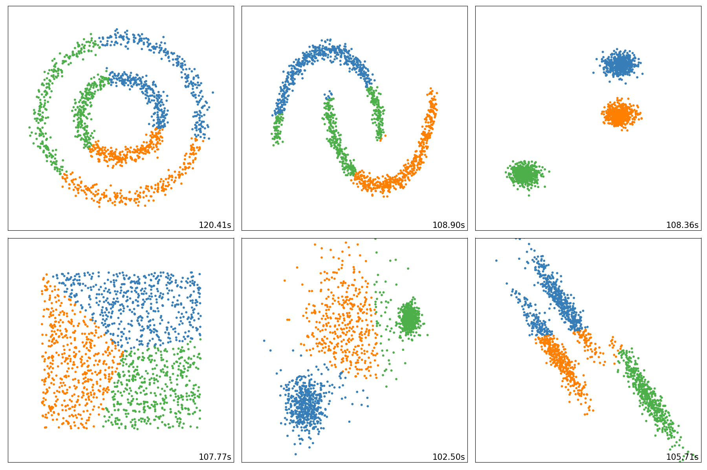

# Metaheuristic Clustering

As the name suggests, this is a repository for metaheuristic clustering algorithms, implemented in Python 3, that I could not find implemented elsewhere.

Implementations are designed to work with or without the sklearn implementation style.

Currently the algorithms implemented are:
- Artifical Bee Colony (ABC)
    - Karaboga and C. Ozturk, "A novel clustering approach: Artificial Bee Colony (ABC) algorithm," Applied soft computing
- Shuffled Frog Leaping Algorithm (SFLA)
    - Amiri, B., Fathian, M., & Maroosi, A. (2009). Application of shuffled frog-leaping algorithm on clustering. The International Journal of Advanced Manufacturing Technology, 45(1), 199-209.
    
## Dependencies
[Numpy](https://numpy.org/)

[PyClustering](https://github.com/annoviko/pyclustering/) 

[scikit-learn](https://scikit-learn.org/stable/) - only needed for interop with scikit-learn

## Example

### Sklearn/Object style

```python
data = X # your data

# SFLA Clustering
from src.sfla import SFLAClustering
sfla_model = SFLAClustering()
sfla_labels = sfla_model.fit_predict(data)

# ABC Clustering
from src.abc import ABCClustering
abc_model = ABCClustering()
abc_labels = abc_model.fit_predict(data)
```

### Function style

```python
import src.util as util
data = X # your data

# SFLA Clustering
import src.sfla as sfla
best_frog =  sfla.sfla(data)
sfla_labels = util.get_labels(data, best_frog)

# ABC Clustering
import src.abc as abc
best_bee = abc.abc(data)
abc_labels = util.get_labels(data, best_bee)
```

### Sample Results

#### ABC


#### SFLA

